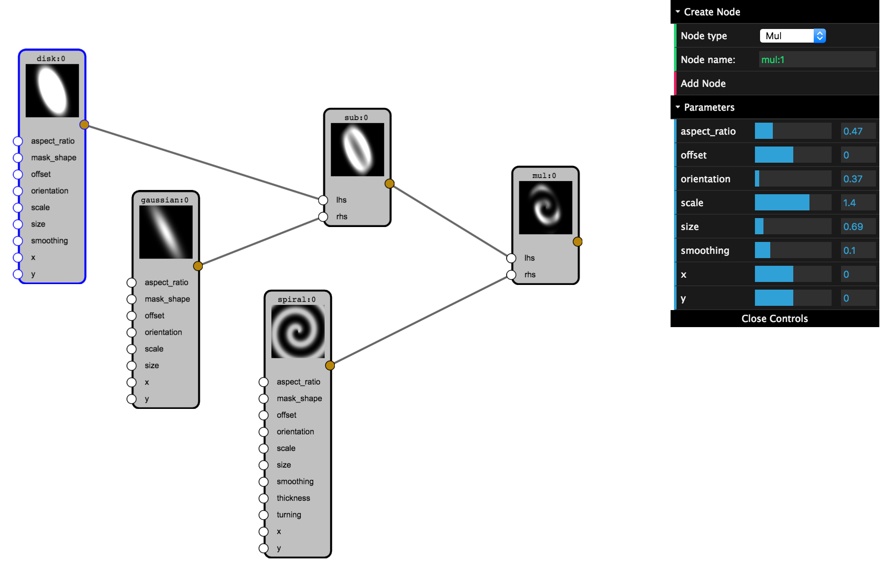

# FlowBox

*Visual dataflow programming between parameterized objects*

Flowbox allows visual programming by connecting and visualizing
parameterized objects.  Examples of types of parameterized objects that
FlowBox aims to support include param parameters and number generators,
[Imagen](https://ioam.github.io/imagen/) patterns and eventually
[HoloViews](holoviews.org) elements in future.

Currently work-in-progress but many of the essential features are now in place. Note that development may be slow as this is currently a personal project that I am working on in my free time.

[](index.html)

*Recommended browser: Chrome with ES6 enabled (chrome://flags/#enable-javascript-harmony)*

## Interaction

+ Scroll up/down: Zoom in/out
+ '+'/'-' : Zoom in/out
+ Drag empty space: Pan view.
+ 'H' : Hide GUI panel.
+ Click node: View node parameters.
+ Drag node: Move node.
+ Drag output port: Create connection.
+ 'd'/'Backspace' over highlighted (red outline): Delete object


## Features

- Visual dataflow programming
- Client/Server architecture allowing deployment online.
- Extensible both on the client- and server-side.
- Compose and manipulate imagen pattern generators visually.

## Developer instructions

- Launch server.

   ```sh
   $ python server.py
   ```

   To serve ES5 Javascript from the es5 directory (needs to be updated with Babel):

   ```sh
   $ python server.py -es5
   ```

- Alternatively:

  ```
  $ python -c "from flowbox.server import main; main('js')"
  ```

### Babel and ES5

This project is written in ES6 using Chrome (with these experimental language features enabled). Recent versions of Firefox support ES6 but for everything else, ES5 is required. To update the ``es5`` directory:

- Install babel globally:

  ```sh
  sudo npm install -g babel-cli
  ```
- Install ES5 'preset':

  ```sh
  npm install babel-preset-es2015
  ```

- Update the contents of the es5 folder:

  ```
  babel ./js/ --out-dir ./es5/
  ```

## About the code

- Written in modern Javascript (ES6)
- Minimal JS dependencies: [fabric](http://fabricjs.com/), [watch.js](https://github.com/melanke/Watch.JS/), [underscore.js](http://underscorejs.org/) and [dat.gui](https://github.com/dataarts/dat.gui).
- Minimal Python dependencies: [tornado](http://www.tornadoweb.org/en/stable/), [pillow](https://python-pillow.org/), [Imagen](https://ioam.github.io/imagen/)


## Goals

+ Offer an alternative to the Jupyter notebook environment.
+ Offer a rich, visual way of manipulate parameterized objects:
  + Param:     Number generators, parameterized classes. Possible alternative to paramnb.
  + HoloViews: Elements, HoloMaps, Layouts, Operations.
  + Imagen:  PatternGenerators.
+ Declarative specification (JSON) that can be loaded from Python or into the browser.
+ Allow custom nodes to be defined on the client (by defining a parameterized class).
+ Personal goal: learn ES6 and modern, idiomatic Javascript.

## TODO

- JQuery used for a single line of code (dependency can be removed).
- Enforce DAG graph + port type checking.
- Save/Load functionality.
- Ensure Python 3 compatibility.
- Personal goal: learn ES6 and modern, idiomatic Javascript.

License
----

To be determined (probably BSD 3-clause).

*Converted to HTML using dillinger.io*